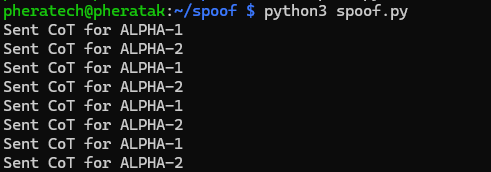
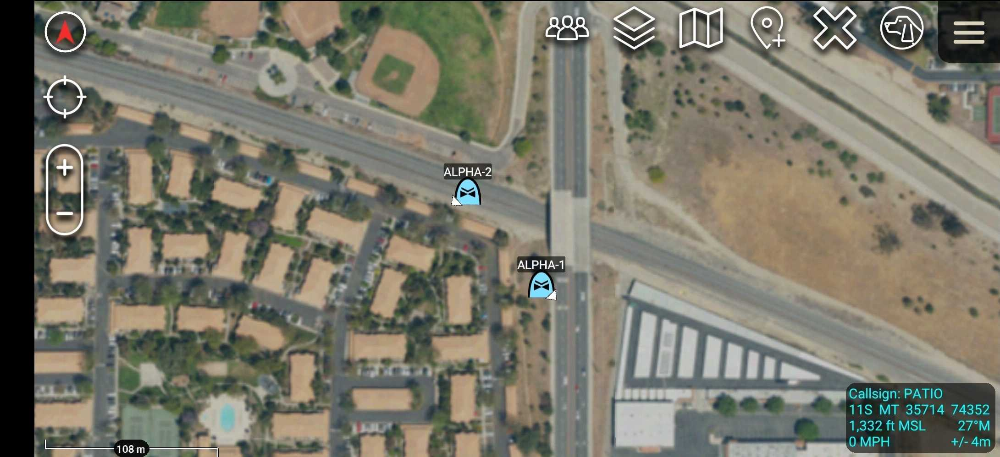

# px4-to-tak

A toolchain for bridging PX4 drone telemetry into the TAK ecosystem (ATAK, WinTAK, iTAK) via OpenTAKServer.

This repo starts with a CoT spoof script for pipeline validation and will grow into a full MAVLink → CoT bridge for live drone swarm situational awareness.

---

## Architecture

```
[PX4 Drones]
     │
     │ MAVLink (UDP 14550)
     ▼
[MAVLink → CoT Bridge]        ← (coming soon)
     │
     │ CoT XML over TCP 8088
     ▼
[OpenTAKServer]
     │
     │ CoT relay
     ▼
[ATAK / WinTAK / iTAK]
```

<p align="center">
  
</p>

<p align="center">
  
</p>

For now, the spoof script bypasses the MAVLink layer and injects CoT directly into OpenTAKServer — useful for validating the OTS → ATAK pipeline before real drones are involved.

---

## Why TCP Port 8088 (not 8087 or 8089)

This is a common point of confusion because most TAK documentation references port **8087** for CoT. Here's the breakdown for OpenTAKServer specifically:

| Port | Protocol | Service | Purpose |
|------|----------|---------|---------|
| 8087 | UDP | — | Legacy TAK UDP CoT broadcast. **OTS 1.7.x does not use this.** |
| 8088 | TCP | `eud_handler` | **Unencrypted TCP CoT streaming. This is what you want for local/trusted networks.** |
| 8089 | TCP | `eud_handler_ssl` | SSL/TLS CoT streaming. Requires a client certificate issued by the OTS CA. |
| 8443 | TCP (HTTPS) | Nginx → OTS | Marti API with mutual TLS. For ATAK client connections, not raw CoT injection. |
| 8080 | TCP (HTTP) | Nginx → OTS | Unauthenticated Marti API access. |
| 8081 | TCP | OTS (internal) | Internal Flask app, loopback only. Not directly accessible. |

### Why not 8087 (UDP)?
OTS 1.7.x has no UDP listener. The `cot_parser` service that previously handled UDP CoT is a one-shot initialization service in this version — it starts, runs for ~5 seconds, and exits. Nothing ever binds to UDP 8087.

### Why not 8089 (SSL)?
Port 8089 works but requires your client to present a valid certificate signed by the OTS Certificate Authority. OTS generates its own CA at install time under `~/ots/ca/`. To use 8089 you would need to:
1. Generate a client cert signed by the OTS CA
2. Load it into your script using Python's `ssl` module
3. Wrap the TCP socket with `ssl.wrap_socket()` or `ssl.SSLContext`

For a trusted local network or development environment, 8088 is simpler and functionally identical. Use 8089 when operating over untrusted networks or when your security requirements demand it.

### Why not send directly to ATAK (no server)?
ATAK can receive CoT directly via UDP multicast on `239.2.3.1:6969` — no server needed. This works fine when all devices are on the same Layer 2 network (e.g. a local WiFi or Doodle Labs mesh). OTS adds persistence, logging, federation, access control, and the ability to bridge across network boundaries (e.g. drones on mesh radio, operators on LTE).

---

## Requirements

- Python 3.x (no external dependencies for the spoof script)
- OpenTAKServer running and accessible on port 8088
- ATAK/WinTAK/iTAK connected to your OTS instance

---

## Scripts

### `spoof_cot.py` — CoT Injection / Pipeline Validator

Simulates multiple PX4 drones by generating fake CoT events and sending them directly to OTS over TCP. Use this to validate your OTS → ATAK pipeline before connecting real drones.

**Usage:**

```bash
python3 spoof_cot.py
```

Edit the `OTS_HOST`, `OTS_PORT`, and `drones` list at the top of the script to match your setup.

**What to expect:**
- Each drone appears on the ATAK map as a rotary-wing UAS icon (`a-f-A-M-H-Q`)
- Drones orbit slowly around their configured starting coordinates
- Tracks update every 1 second
- Stale timeout is 60 seconds — tracks disappear from ATAK if the script stops

**CoT type codes used:**

| Type | Description |
|------|-------------|
| `a-f-A-M-H-Q` | Friendly Rotary Wing UAS (default) |
| `a-f-A-M-F-Q` | Friendly Fixed Wing UAS |
| `a-u-A-M-H-Q` | Unknown Rotary Wing UAS |
| `a-h-A-M-H-Q` | Hostile Rotary Wing UAS |

---

## Planned

- [ ] MAVLink → CoT bridge (`mavlink_bridge.py`) using pymavlink
- [ ] PX4 SITL integration instructions
- [ ] Multi-drone swarm support with per-drone callsign config
- [ ] SSL/8089 client cert support
- [ ] Direct UDP multicast mode (no server) for same-network operation
- [ ] ATAK data package / server profile generator for easy client onboarding

---

## Notes

- OTS web UI may not show injected tracks under "Clients" — clients are connected ATAK devices. Look for a "Units" or "Tracks" section for CoT-injected entities.
- CoT `uid` must be stable across updates for ATAK to treat repeated messages as position updates rather than new tracks. Keep UIDs consistent per drone.
- The `stale` field controls how long ATAK displays a track after it stops receiving updates. 60 seconds is reasonable for live telemetry. Increase for slower update rates.
- OTS is running behind Nginx. The Nginx stream proxy handles TCP CoT ports — check `/etc/nginx/streams-enabled/` if ports change after an OTS update.